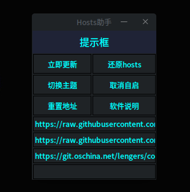
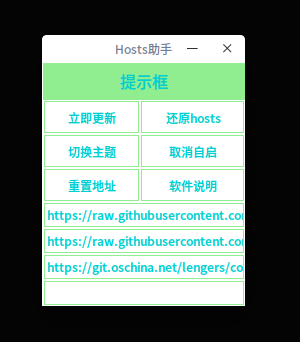

# Hosts-Assistant

用途：帮助更新hosts文件

软件说明：由于hosts文件经常失效，手动改hosts还是挺麻烦的，所以写了这个软件。

使用说明：hosts文件源来自互联网，本人不保证安全，可自行修改。如果修改后发现有问题，可以点击还原hosts按钮，
还原到最初。替换hosts文件后可能不会立即生效，可以关闭/开启网络，或启用/禁用飞行模式让域名解析立即生效。
开机自启表示软件会在开机时在后台启动并自动更新hosts，直到成功。软件选择地址列表中连接最快的作为源文件，
各源内容不相同。更新hosts完成后，地址显示红色的表示超时或者失效，显示绿色的表示最终的hosts文件来源。

软件安装方法：

1、首先获得hosts文件的读写权限，最简单的方法是执行命令：sudo chmod 777 /etc/hosts 如果觉得这种方法不安全，   可 以将本py文件所有者改为root，然后给本文件加上setuid标志。

2、安装python3的tkinter模块，命令： sudo apt-get install python3-tk

3、打开终端，在终端中输入命令：python3 路径/Hosts助手.py

4、成功，以后可以从启动器打开

  

  

